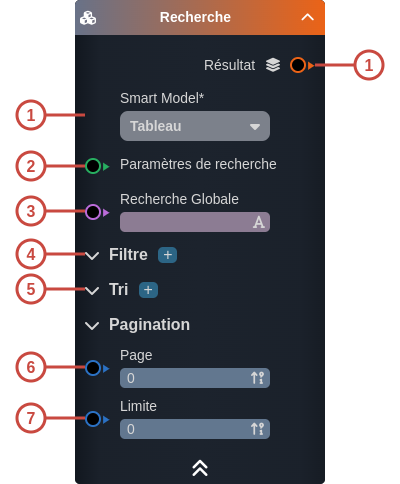
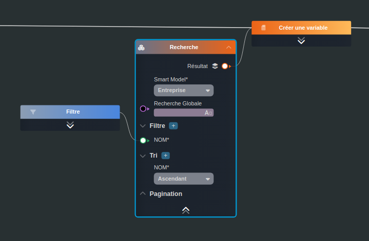

---
tags:
- smartflow
- workflow
---
   
# Recherche   
   
`{_obsidian_pattern_tag_smartflow}` `{_obsidian_pattern_tag_workflow}`   
   
## Description   
   
Le nœud **Recherche** permet d'effectuer une recherche sur les [Smart Objects](../_glossaire/Glossaire.md) en base de données à partir d'un [Smart Model](../_glossaire/Glossaire.md).   
   
   
Il est possible d'appliquer à la recherche, des filtres, du tri ainsi que de la pagination (par défaut, la limite est à 100).   
   
## Fonctionnement   
   
   
   
### Entrées   
   
| ID | Nom | Type | Description |   
|:-|:-|:-|:-|   
| 1 | Smart Model | string | Le [Smart Model](../_glossaire/Glossaire.md) des objets où l'on souhaite effectuer la recherche |   
| 2 | Paramètres de recherche | sys:query | Objet injecté via la source `search-parameters` (variable d'entrée).  Utilisée en interne pour injecter les paramètres de recherche et de pagination d'un widget itérable (tableau, liste) ou d'une tâche itérable (Liste) |   
| 3 | Recherche Globale | string | La recherche globale permet une recherche textuelle sur toutes les propriétés du [Smart Object](../_glossaire/Glossaire.md) (utilisée en plus des filtres) |   
| 4 | Filtre | section | La liste des [filtres](../R%C3%A9f%C3%A9rences%20des%20noeuds/Filtre.md) à appliquer sur les propriétés du [Smart Object](../_glossaire/Glossaire.md).  Lorsqu'il y a plusieurs filtres, c'est l'ensemble d'entre eux qui constituera un résultat positif. |   
| 5 | Tri | section | Le tri de la liste s'applique sur une ou plusieurs propriété des [Smart Objects](../_glossaire/Glossaire.md). |   
| 6 | Page | number | Le numéro de la page (page 2 / 50) |   
| 7 | Limite | number | La limite par page |   
   
### Sorties   
   
| ID | Nom | Type | Description |   
|:-|:-|:-|:-|   
| 1 | Résultat | so: | La liste des [Smart Objects](../_glossaire/Glossaire.md) demandés |   
   
## Utilisation   
   
### Studio   
   
