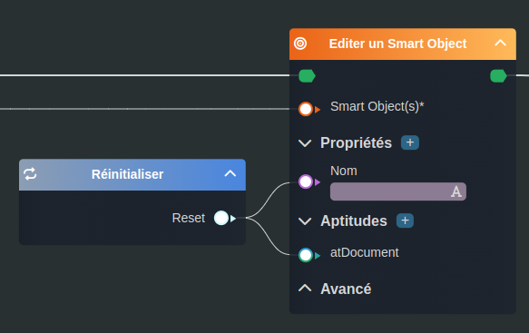

---
tags:
- smartflow
- workflow
---
   
# Réinitialiser   
   
`{_obsidian_pattern_tag_smartflow}` `{_obsidian_pattern_tag_workflow}`   
   
## Description   
   
Le nœud **Réinitialiser** permet de réinitialiser une propriété ou une aptitude d'un [Smart Object](../_glossaire/Glossaire.md).   
   
   
Le résultat produit par le nœud doit se brancher avec la propriété ou l'aptitude à réinitialiser.   
   
## Fonctionnement   
   
   
   
### Sorties   
   
| ID | Nom | Type | Description |   
|:-|:-|:-|:-|   
| 1 | Reset | reset | La réinitialisation à brancher à l'aptitude ou la propriété à réinitialiser |   
   
## Utilisation   
   
### Studio   
   
