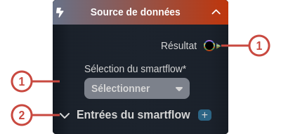

---
tags:
- smartflow
- workflow
---
   
# Source de données   
   
`{_obsidian_pattern_tag_smartflow}` `{_obsidian_pattern_tag_workflow}`   
   
## Description   
   
Le nœud **Source de données** permet de récupérer le résultat d'un [smartflow](../_glossaire/Glossaire.md).   
   
   
Ce nœud est l'équivalent de la tâche [Appeler un smartflow](../R%C3%A9f%C3%A9rences%20des%20noeuds/Appeler%20un%20smartflow.md), à la différence qu'il est permet d'effectuer une [liaison de type data](../05%20-%20Workflows%2C%20cr%C3%A9er%20votre%20logique%20m%C3%A9tier/5%20-%20Les%20liaisons%20de%20type%20data.md).   
   
## Fonctionnement   
   
   
   
### Entrées   
   
| ID | Nom | Type | Description |   
|:-|:-|:-|:-|   
| 1 | Sélection du smartflow | string | Le [smartflow](../_glossaire/Glossaire.md) dont on veut récupérer le résultat |   
| 2 | Entrées du smartflow | section | Cette section liste les différentes variables d'entrées du [smartflow](../_glossaire/Glossaire.md) sélectionné. Si celui-ci n'en possède pas, cette section n'est pas affichée. |   
   
### Sorties   
   
| ID | Nom | Type | Description |   
|:-|:-|:-|:-|   
| 1 | Résultat | string, number, date, time, datetime, boolean, so:, sys:, object | Le résultat retourné par le [smartflow](../_glossaire/Glossaire.md) appelé |