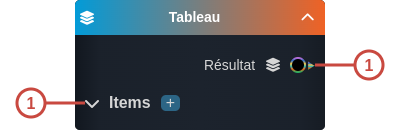

---
tags:
- smartflow
- workflow
---
   
# Tableau   
   
`{_obsidian_pattern_tag_smartflow}` `{_obsidian_pattern_tag_workflow}`   
   
## Description   
   
Le nœud **Tableau** permet de créer un tableau de n'importe quel type.   
   
   
Le type du tableau dépendra du type des items qu'il contiendra.    
   
## Fonctionnement   
   
   
   
### Entrées   
   
| ID | Nom | Type | Description |   
|:-|:-|:-|:-|   
| 1 | Items | section | La liste des items du tableau. |   
   
### Sorties   
   
| ID | Nom | Type | Description |   
|:-|:-|:-|:-|   
| 1 | Résultat | string, number, date, time, datetime, boolean, so:, sys: | Le tableau créé typé selon le type des items |