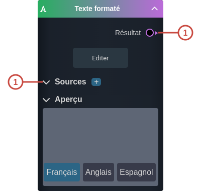

---
tags:
- smartflow
- workflow
---
   
# Texte formaté   
   
`{_obsidian_pattern_tag_smartflow}` `{_obsidian_pattern_tag_workflow}`   
   
## Description   
   
Le nœud **Texte formaté** permet de rédiger un texte dans les différentes langues du système.   
Le texte affiché dans le Player sera le texte traduit dans la langue de l'utilisateur.   
   
   
Pour éditer du texte, il faut sélectionner le bouton éditer.   
La fenêtre d'édition affichée permet de sélectionner la langue, utiliser les sources (si renseignées) et d'afficher l'aperçu.    
   
## Fonctionnement   
   
   
   
### Entrées   
   
| ID | Nom | Type | Description |   
|:-|:-|:-|:-|   
| 1 | Sources | section | La liste des sources à utiliser dans le texte |   
   
### Sorties   
   
| ID | Nom | Type | Description |   
|:-|:-|:-|:-|   
| 1 | Résultat | string | Le texte produit |