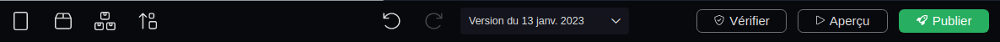

---
{}
---
   
# Menu contextuel   
   
Le menu contextuel est le menu qui s'affiche lorsqu'on fait un clic droit sur un élément.   
   
# Toolbar   
   
La toolbar correspond à la barre d'outils en en-tête du [Workflow Editor](../_glossaire/Glossaire.md#workflow-editor), [Smartflow Editor](../_glossaire/Glossaire.md#smartflow-editor) ou de l'[UI Composer](../_glossaire/Glossaire.md#ui-composer).   
   
   
   
Elle est répartie en trois parties :   
   
   
- Sur la gauche des boutons d'actions propres à l'outil sur lequel on est   
- Au centre des boutons d'actions précédentes et suivantes ainsi que le menu pour versionner   
- Sur la droite les boutons de vérification, aperçu et publication   
   
# Toolbox   
   
Présente dans l'[UI Composer](../_glossaire/Glossaire.md#ui-composer), c'est la barre latérale de gauche qui permet de configurer l'application, d'accéder au catalogue de widgets ainsi qu'à l'arborescence de widgets déjà déposés sur les pages.   
   
# Inspecteur   
   
C'est la barre latérale de droite présente sur le [Workflow Editor](../_glossaire/Glossaire.md#workflow-editor), [Smartflow Editor](../_glossaire/Glossaire.md#smartflow-editor), [Data Modeler](../_glossaire/Glossaire.md#data-modeler) ou [UI Composer](../_glossaire/Glossaire.md#ui-composer) qui permet de configurer les éléments sélectionnés sur la zone de travail.   
   
# Smart Model   
   
Un Smart Model représente un modèle d'objet : il décrit les différents champs qui le définissent ainsi que les possibles associations avec d'autres modèles. Ce modèle agit comme un moule et va permettre de créer des objets, [ les Smart Objects](/not_created.md).   
   
# Smart Object   
   
Les Smart Objects sont des instances d'objets créés à partir d'un [Smart Model](../_glossaire/Glossaire.md) particulier qui possèdent l'ensemble des champs définis par ce [Smart Model](../_glossaire/Glossaire.md). Ils représentent l'ensemble des données manipulées sur Vision.    
   
# Smartflow   
   
Un smartflow est un outil de gestion de flux de données. Ce sont des processus exécutés côté serveur utilisés pour la création d'API et un usage interne : dans les applications, les [workflows](../_glossaire/Glossaire.md) ou les smartflows (appel récursif).   
   
# SmartLink   
   
Le SmartLink est un lien qui va permettre de jouer le [workflow](../_glossaire/Glossaire.md) dans un player.   
   
# Workflow   
   
Un workflow est un flux opérationnel constitué d'une suite de tâches qui a pour vocation d'être graphique et d'être joué depuis le Player. L'utilisateur du workflow doit interagir (remplir des formulaires, sélectionner des éléments...) avec le workflow pour le terminer.   
   
# OpenAPI   
   
OpenAPI est basée sur le langage JSON ou YAML et est utilisée pour créer des descriptions de fonctionnalités et des spécifications pour les API qui peuvent être utilisées par les développeurs pour créer des applications clientes et des services web.   
   
# KISS   
   
Keep Improve Start Stop   
   
# Data Modeler   
   
Le Data Modeler est l'outil de Vision qui permet de modéliser les modèles. Chaque nœud du Data Modeler correspond à un [Smart Model](../_glossaire/Glossaire.md).   
   
# Workflow Editor   
   
Le Workflow Editor est l'outil de Vision qui permet de concevoir des [workflows](../_glossaire/Glossaire.md#workflow).   
   
# Smartflow Editor   
   
Le Smartflow Editor est l'outil de Vision qui permet de concevoir des [smartflows](../_glossaire/Glossaire.md#smartflow).   
   
# UI Composer   
   
L'UI Composer est l'outil de Vision qui permet de concevoir les interfaces des applications.   
   
# Database Editor   
   
Le Database Editor est l'outil de Vision qui permet de gérer tous les [Smart Objects](../_glossaire/Glossaire.md) présents dans la base de données de Vision.   
   
# Liste générique   
   
Les liste génériques, les *glists*, sont des listes de chaînes de caractères que l'on peut définir sur Vision et ensuite utiliser sur les propriétés string des [Smart Objects](../_glossaire/Glossaire.md) pour limiter les valeurs à une liste de choix spécifiques.    
   
# Widget   
   
C'est un élément graphique qui compose les pages d'une application Vision (bouton, texte, image, ...).    
   
# Nœud   
   
Dans les [workflows](../_glossaire/Glossaire.md#workflow) et [smartflows](../_glossaire/Glossaire.md#smartflow), les instructions sont représentées par des nœuds qui correspondent aux différentes fonctionnalités ou tâches disponibles (_Formulaire, Prise de photo, Choix Multiple, ...).